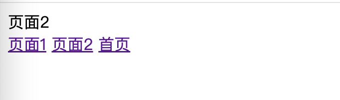

[返回](../README.md)

### 页面切换 v2

前面已经实现一个页面切换的版本，接下来，我们加入路由的概念，通过切换页面路由来完成页面的切换。

先修改一下 index.html 文件：

```html
<body>
  <div id="app">首页</div>
  <a href="#page1">页面1</a>
  <a href="#page2">页面2</a>
  <a href="#">首页</a>
  <script src="./main.js"></script>
</body>
```

我们把标签 a 的 onclick 事件去掉了，为 href 加了点内容，这样，我们可以通过 hash 的值，为完成页面的切换。

我们来监听一下页面的 hash 变化：

```js
// main.js
// 新增
init()

function init() {
  window.addEventListener('hashchange', (evt) => {
    // to-do
  })
}

// 省略部分代码
```

增加 hash 变化的处理逻辑：

```js
init()

function init() {
  window.addEventListener('hashchange', (evt) => {
    // 新增
    hashChange()
  })
}

// 新增
// hash 变化处理
function hashChange() {
  let hash = location.hash
  if (hash.startsWith('#')) hash = hash.substr(1)
  change(hash)
}

// 省略部分代码
```

在函数 hashChange 里，我们取得了 hash 值， 通过去掉 hash 前面的 # 之后，我们就能取得标签 a 配置的 page1、page2 等值了。

接下来再修改一下函数 change ：

```js
function change(val) {
  if (val == 'page1') {
    // 修改
    page1()
  } else if (val == 'page2') {
    // 修改
    page2()
  } else {
    pageHome()
  }
}
```

运行效果如下：



我们可以通过点击那几个链接完成页面的切换。

至此，我们通过监听 hash 路由的变化，完成了页面切换功能。
