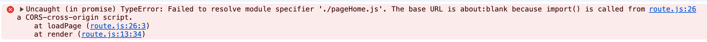

[返回](/README.md)

### 动态加载页面 v3

使用 ES module 之后，页面的代码得修改一下：

```js
// page1.js
export function render() {
  const container = document.getElementById('app')
  container.innerHTML = '页面1'
}
```

剩下的页面都差不多，

只不过我们统一导出一个叫 render 的函数。

接下来修改一下 route.js 里的代码：

```js
// ... 省略部分代码
function resolveConfig(config) {
  for (let i = 0; i < config.length; i++) {
    let { path, render, entry } = config[i]
    if (!render && entry) {
      render = async () => {
        // 修改
        const { render } = await loadPage(entry)
        render()
      }
    }

    if (render) {
      routeMap.set(path, () => Promise.resolve().then(render))
    }
  }
}

// 修改
function loadPage(entry) {
  return import(entry)
}
// ... 省略部分代码
```

运行一下看看效果



看上去是一个很麻烦的问题，

其实很好解决，我们让页面跑在服务器上！

没必要自己使用 express 整个本地 node 服务，

我们可以使用 vscode 里丰富好用的插件，比如：


安装好后，选中对应的 html 文件，然后右键：


很快，服务就跑起来了！

效果如下图所示：


点击切换一下页面，非常 6 。

在 vscode 的底下也能找到 live server ，


通过点击切换启动关闭服务。

也不用太担心 import 的兼容性问题：


全球非常流行的 chrome 浏览器，2017 年已经支持了！

还是有点担心兼容度太低了，

怎么办呢？
