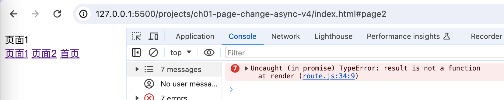

[返回](/README.md)

### 动态加载页面 v4

我们知道，当一个 js 文件被浏览器加载完之后，浏览器就会执行文件对应的 js 代码，比如 page1.js ：

```js
// page1.js
function page1() {
  const container = document.getElementById('app')
  container.innerHTML = '页面1'
}
```

这时，全局作用域下就存在了一个方法 page1 ，我们怎样才能取得这个函数呢？

有一个大家都比较熟悉的笨办法，

我们先收集一下 window 所有的属性：

```js
// route.js
const windowProps = new Set()

// 给 window 拍个照
function snapshotWindow() {
  for (let key in window) {
    windowProps.add(key)
  }
}
```

给 window 拍个照，保存到 windowProps 集合里，

然后再重构一下函数 resolveConfig :

```js
// route.js

function resolveConfig(config) {
  for (let i = 0; i < config.length; i++) {
    let { path, render, entry } = config[i]
    if (!render && entry) {
      // 修改
      render = async () => {
        snapshotWindow()

        await loadPage(entry)
        const result = findWindowAddProps()

        result()
        snapshotWindow()
      }
    }

    if (render) {
      routeMap.set(path, () => Promise.resolve().then(render))
    }
  }
}

// 动态加载页面
function loadPage(entry) {
  return new Promise((resolve, reject) => {
    const node = document.createElement('script')
    node.src = entry
    node.onload = () => {
      resolve()
    }
    document.head.appendChild(node)
  })
}

// 省略部分代码
```

如上述代码所示，当要去加载页面时，先给 window 拍个照，这时就把 window 里所有属性给保存下来了，等页面 js 加载好之后，我们再去找 windowProps 上新增的属性：

```js
function findWindowAddProps() {
  for (let key in window) {
    if (windowProps.has(key)) continue
    return window[key]
  }
}
```

如上所示，我们就能找到刚加载的页面渲染函数，取得之后就可以执行一下了，页面自然也就更新了。

最后，再调用一下函数 snapshotWindow ，确保下个页面的函数能够找着。

运行一下看看效果：



第一次点击页面是可以正常切换的，可第二次点击时，就报上图所示的错误了！

其实问题很简单，当第二次加载 js 文件时，window 上应该有对应的函数了，window 上自然不会新增属性，通过函数 findWindowAddProps 就找不到我们需要的方法。

我们只需要简单优化一下即可，一来我们可以保存一下找到的方法，二来我们也不需要多次加载页面资源：

```js
// route.js
function resolveConfig(config) {
  for (let i = 0; i < config.length; i++) {
    let { path, render, entry } = config[i]
    if (!render && entry) {
      render = async () => {
        snapshotWindow()

        await loadPage(entry)
        const result = findWindowAddProps()

        result()
        // 新增
        render._cache = result

        snapshotWindow()
      }
    }

    if (render) {
      // 修改
      routeMap.set(path, render)
    }
  }
}
```

同样的，再修改一下函数 update ：

```js
function update(path) {
  if (routeMap.has(path)) {
    // 修改
    const render = routeMap.get(path)
    Promise.resolve().then(render._cache || render)
  }
}
```

当 render 函数存在 \_cache 时，就执行 \_cache 方法。

现在可以很顺畅的切换了！
