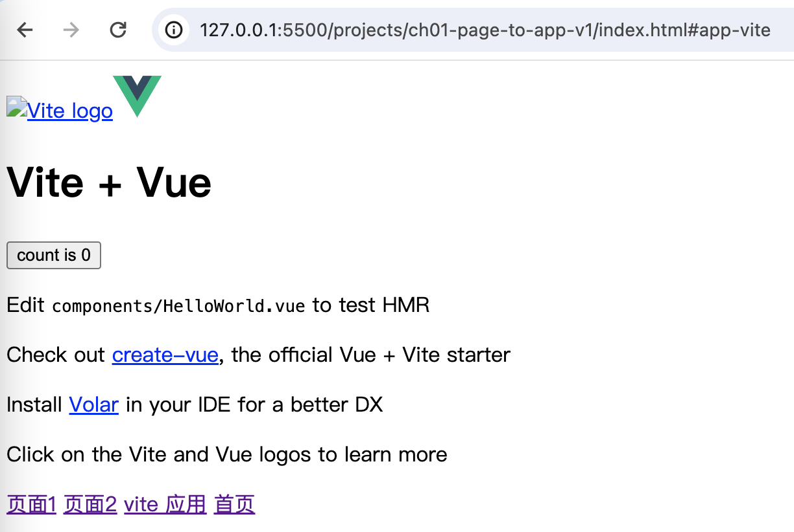
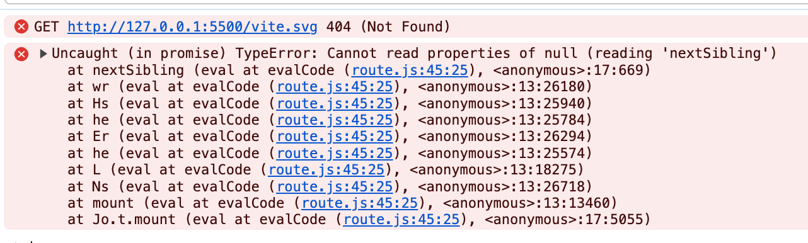

[返回](/README.md)

### 页面升级为应用 v1

前面多篇讲的是动态按需加载 js 文件，而我们把一个 js 文件抽象为一个页面，

实际的业务需求里，一个页面肯定不仅仅只有一个 js 文件，

我们也不会为每个页面都整成一个单独的项目去做，

大家比较熟悉的框架，也都支持路由按需加载，还非常完善好用。

那我们前面为什么要说这块呢？

因为我想写，就是这么任性。

严肃一点的说法是，之前的大纲就是这么写的，，，

现在要将页面升级为应用，那我们就得先整个应用。

就用 vite 来创建一个项目吧：

```sheel
pnpm create vite
```

根据提示，

```text
✔ Project name: vite-app-vue-01
✔ Select a framework: › Vue
✔ Select a variant: › JavaScript
```

再之后就是安装一下包：

```sheel
pnpm i
```

然后 build 一下，再 preview 即可。

通过浏览器就可以预览这个刚整好的项目了，

这时，我们打开浏览器的调试工具，取得 index.js 的路径：

`http://localhost:4173/assets/index-GTf1oZOv.js`

修改一下 routeConfig ：

```js
const routeConfig = [
  { path: 'page1', entry: './page1.js' },
  { path: 'page2', entry: './page2.js' },
  // 新增
  { path: 'app-vite', entry: 'http://localhost:4173/assets/index-GTf1oZOv.js' },
  { path: '', entry: './pageHome.js' },
]

route(routeConfig)
```

随便修改一下 index.html 文件：

```html
<!DOCTYPE html>
<html lang="en">
  <head>
    <meta charset="UTF-8" />
    <meta http-equiv="X-UA-Compatible" content="IE=edge" />
    <meta name="viewport" content="width=device-width, initial-scale=1.0" />
    <title>Document</title>
  </head>
  <body>
    <div id="app">首页</div>
    <a href="#page1">页面1</a>
    <a href="#page2">页面2</a>
    <!-- 新增 -->
    <a href="#app-vite">vite 应用 </a>
    <a href="#">首页</a>
    <script src="./route.js"></script>
    <script src="./main.js"></script>
  </body>
</html>
```

运行一下，看看切换到 vite 应用是什么效果：



还行，马马虎虎。

我们来回切换看看：



报错了，页面也没有正常显示了。

不过，没关系，我们已经踏出了非常重要的第一步。
