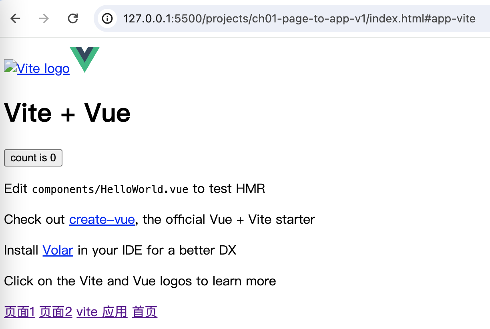

[返回](/README.md)

### 页面升级为应用 v3

上个版本处理的不完整，代码还无法常跑起来，还得进一步处理。

先来看一下 app/index.js ：

```js
// app/index.js

// 省略部分代码

// 更新应用
export function updateApps(path) {
  // 找到要销毁的应用
  const needUnmountApps = registerApps.filter((app) => app.status == PLAY && app.path != path)
  needUnmountApps.forEach(unmount)
  // 找到要启用的应用
  const needMountApps = registerApps.filter((app) => app.path == path)
  // 修改
  needMount(needMountApps)
}

// 新增
function needMount(apps) {
  for (let i = 0; i < apps.length; i++) {
    const app = apps[i]
    const status = app.status
    if (status == INIT) {
      loading(app).then(mount)
    } else if (status == WAIT) {
      mount(app)
    }
  }
}
```

我们发现，需要启用的应用状态会比较多，比如初始态、加载状态以及就绪状态，这就需要我们用不同的策略处理。

对应初始态的应用，我们需要先加载应用，加载完成之后，再挂载：

```js
// app/lifecycle/loading.js
import { INIT, LOADING, WAIT } from '../const.js'
import { fetchJscript, evalCode, snapshotWindow, findWindowAddProps } from '../utils.js'

export function loading(app) {
  if (app.status != INIT) return Promise.resolve()

  app.status = LOADING

  return fetchJscript(app.entry).then((code) => {
    snapshotWindow()
    evalCode(app.entry, code)
    const result = findWindowAddProps()

    app.mount = result.mount
    app.unmount = result.unmount
    app.status = WAIT

    return app
  })
}
```

而且不是简单的加载应用，还需要取得应用对外的接口，如 mount/unmount ，在函数 mount 里，我们是会调用应用的 mount 方法滴。

所以，这里又用上了之前我们写过的函数 snapshotWindow 及 findWindowAddProps 。

现在存在一个问题，我们之前创建的 vite 项目并没有对外的接口，

这就需要我们去处理一下：

```js
// vite.config.js

import { defineConfig } from 'vite'
import vue from '@vitejs/plugin-vue'
import path from 'path'

// https://vitejs.dev/config/
export default defineConfig({
  plugins: [vue()],
  build: {
    lib: {
      entry: path.resolve(__dirname, 'src/main.js'),
      name: 'MyLib',
      fileName: (format) => `my-lib.${format}.js`,
    },
    rollupOptions: {
      // 确保外部化处理那些你不想打包进库的依赖
      external: ['vue'],
      output: {
        // 在 UMD 构建模式下为这些外部化的依赖提供一个全局变量
        globals: {
          vue: 'Vue',
        },
      },
    },
  },
})
```

通过上面 build.lib 的配置，应用就会打包生成相应的 umd / es js 文件，如下图所示：


需要注意的是，我们将应用中用到的 vue 框架代码给剥离了出来，并没有打包进应用的代码里。这就需要在我们的主应用里引用一下 vue :

```html
<!DOCTYPE html>
<html lang="en">
  <head>
    <meta charset="UTF-8" />
    <meta http-equiv="X-UA-Compatible" content="IE=edge" />
    <meta name="viewport" content="width=device-width, initial-scale=1.0" />
    <title>Document</title>

    <!-- 新增 -->
    <script src="https://unpkg.com/vue@3/dist/vue.global.js"></script>
  </head>
  <body>
    <div id="app">首页</div>
    <a href="#page1">页面1</a>
    <a href="#page2">页面2</a>
    <a href="#app-vite">vite 应用</a>
    <a href="#">首页</a>
    <!-- 修改 -->
    <script src="./main.js" type="module"></script>
  </body>
</html>
```

由于 main.js 文件使用了 ES Module，所以，页面中引入的 script 标签需要加一下 type 为 module 。

通过上述一系列的重构之后，我们来测试一下应用切换：



如上图所示，可以顺利的来回切换 vite 应用了。
