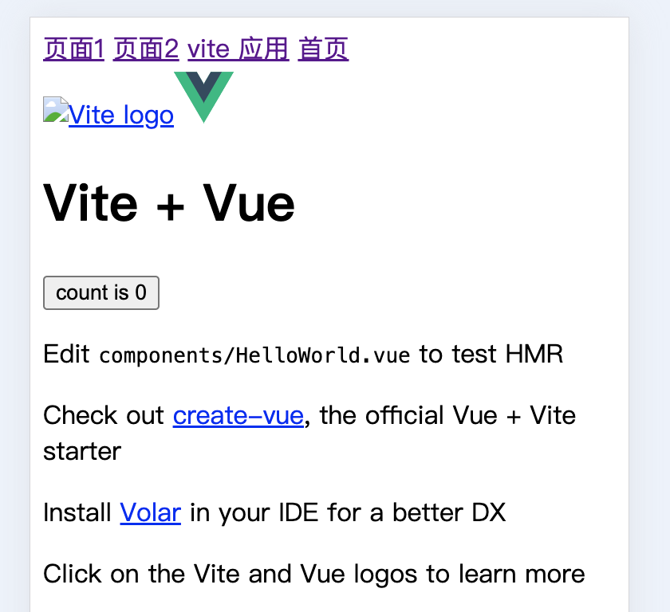
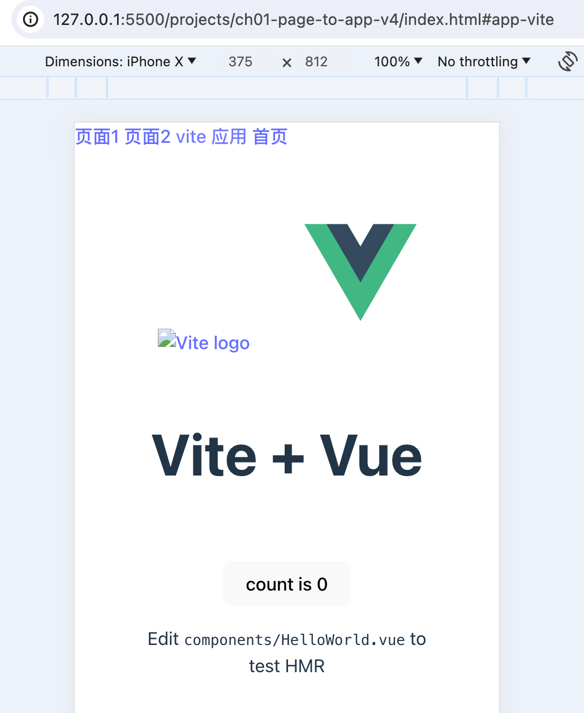

[返回](/README.md)

### 页面升级为应用 v4

上个版本，我们简单的实现了应用的切换，不过，有个比较明显的问题需要立马解决：

应用没有样式！

页面太丑了，忍不了了，得改改。

先修改一下页面布局：

```html
<body>
  <div>
    <a href="#page1">页面1</a>
    <a href="#page2">页面2</a>
    <a href="#app-vite">vite 应用</a>
    <a href="#">首页</a>
    <script src="./main.js" type="module"></script>
  </div>

  <div id="app">首页</div>
</body>
```

然后，再修改一下子应用的 body 样式：

```css
body {
  margin: 0;
  /* display: flex; */
  place-items: center;
  min-width: 320px;
  min-height: 100vh;
}
```

把其中的 display 样式注释掉。

效果如下图所示：
<!--  -->


接下来就是功能扩展了，

我们得支持样式，就需要提供一个样式的入口。

比较简单的方式如下：

```js
// main.js

import { route } from './route.js'
const routeConfig = [
  { path: 'page1', entry: './page1.js' },
  { path: 'page2', entry: './page2.js' },
  {
    type: 'app',
    path: 'app-vite',
    // 修改
    entry: {
      main: 'http://localhost:4173/my-lib.umd.js',
      style: 'http://localhost:4173/style.css',
    },
  },
  { path: '', entry: './pageHome.js' },
]

route(routeConfig)
```

通过扩展 entry 属性，使 entry 支持对象数据的配置，那给样式加个配置的属性就很简单了。

由于扩展了 entry 属性，不可避免的就需要修改注册应用的接口了：

```js
// app/index.js

// 注册一个应用
export function registerApp(data) {
  // 修改
  const { entry, ...app } = data
  if (!entry) {
    throw new Error('子应用必须配置 entry')
  }

  app.status = INIT
  app.entry = normalEntry(entry)

  registerApps.push(app)
}

// 规格化 entry
function normalEntry(entry) {
  if (typeof entry == 'string') return { main: entry }
  return entry
}

// 省略部分代码
```

简单重构了一下接口 registerApp ，使 entry 支持字符串及对象两种数据结构的配置方式。

由于 entry 最后被规格化为对象了，对应的生命周期接口 loading 也需要相应的修改：

```js
// app/lifecycle/loading.js
import { INIT, LOADING, WAIT } from '../const.js'
import { fetchJscript, evalCode, snapshotWindow, findWindowAddProps, fetchCss } from '../utils.js'

export function loading(app) {
  if (app.status != INIT) return Promise.resolve()

  app.status = LOADING

  // 修改
  return fetchEntry(app.entry).then((code) => {
    snapshotWindow()
    evalCode(app.entry, code)
    const result = findWindowAddProps()

    app.mount = result.mount
    app.unmount = result.unmount
    app.status = WAIT

    return app
  })
}

// 新增
function fetchEntry(entry) {
  const { main, style } = entry

  // 加载 style 样式
  fetchCss(style).then((code) => {
    const sheet = new CSSStyleSheet()
    sheet.replaceSync(code)
    document.adoptedStyleSheets = [...document.adoptedStyleSheets, sheet]
  })

  return fetchJscript(main)
}
```

看下 fetchCss 的实现：

```js
// /app/utils.js
let evalCodeMap = new Map()

// 取得 js 代码
export function fetchJscript(entry) {
  return fetchText(entry, evalCodeMap)
}

export function fetchCss(path) {
  return fetchText(path)
}

function fetchText(path, cache) {
  // 优化多次 fetch
  if (cache && cache.has(path)) return Promise.resolve()

  return fetch(path).then((res) => {
    if (res.status >= 400) {
      throw new Error(`${path} 文件加载失败，status 是 ${res.status}`)
    }
    return res.text()
  })
}
```

这里简单的重构了一下代码。

最后看下效果：

<!--  -->


样式应用上去后，页面漂亮多了。
