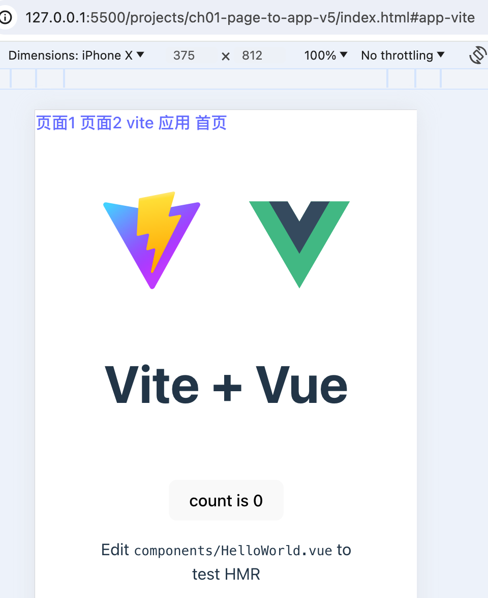

[返回](/README.md)

### 页面升级为应用 v4

考虑过之前的样式应用方式兼容性不高，

所以，有必要弄个新的策略，

其实实现起来也非常简单：

```js
// app/lifecycle/loading.js
function fetchEntry(entry) {
  const { main, style } = entry

  // 加载 style 样式
  fetchCss(style).then((code) => {
    // const sheet = new CSSStyleSheet()
    // sheet.replaceSync(code)
    // document.adoptedStyleSheets = [...document.adoptedStyleSheets, sheet]
    // 修改
    const node = document.createElement('style')
    node.setAttribute('type', 'text/css')
    node.textContent = code
    document.head.appendChild(node)
  })

  return fetchJscript(main)
}
```

我们通过往 head 里插入一个 style 节点，

完成了样式的应用。

看下效果：


效果跟上个版本是一样的，但是，兼容性更高了。

页面整体看上去没什么问题，就是其中有张图片没有显示，

通过排查发现是由于路径问题，

图片的请求路径为： `http://127.0.0.1:5500/vite.svg`

很明显，当前请求服务下是没有这张图片的，

问题解决方式也简单，只需要修改子应用的 vite.config.js 文件：

```js
// vite.config.js
export default defineConfig({
  base: 'http://localhost:4173/',
  plugins: [vue()],
  // 省略部分代码
})
```

静态图片的无法获取的问题就解决了。

效果如下：



