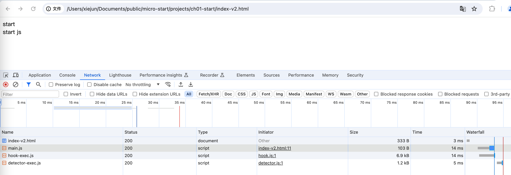

#### 导航

[返回](../README.md)

### 准备工作

在 projects 文件夹下新建一个 ch01-start 的文件夹

进入 ch01-start 文件夹

新建一个 html 文件 index.html

通过 html:5 生成 html 内容：

```html
<!DOCTYPE html>
<html lang="en">
  <head>
    <meta charset="UTF-8" />
    <meta http-equiv="X-UA-Compatible" content="IE=edge" />
    <meta name="viewport" content="width=device-width, initial-scale=1.0" />
    <title>Document</title>
  </head>
  <body></body>
</html>
```

在标签 body 里加点内容，比如：

```html
<body>
  <!-- 新增 -->
  <div>start</div>
</body>
```

使用浏览器打开看下效果。

接下来我们使用 JS 来显示点内容：

```html
<body>
  <div>start</div>

  <!-- 新增 -->
  <script>
    const node = document.createElement('div')
    node.innerHTML = 'start js'
    document.body.appendChild(node)
  </script>
</body>
```

上述代码，我们通过 JS 实现了往 body 里插入节点的功能。

我们还可以通过外部引入 JS 文件的方式，使用强大的 JS :

文件 index.html :

```html
<body>
  <div>start</div>
  <!-- 修改 -->
  <script src="./main.js"></script>
</body>
```

文件 main.js :

```js
const node = document.createElement('div')
node.innerHTML = 'start js'
document.body.appendChild(node)
```

效果跟第一种方式是一样的：



我们发现，浏览加载完 index.html 文件之后，接着又去加载 main.js 文件了。